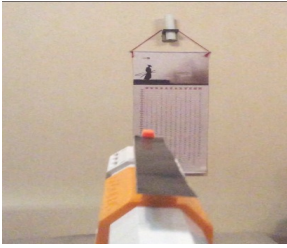
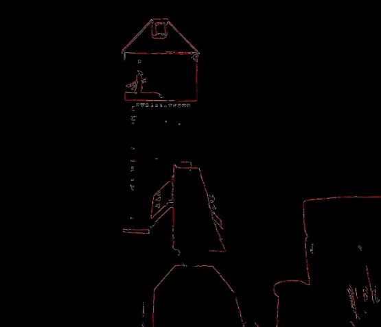
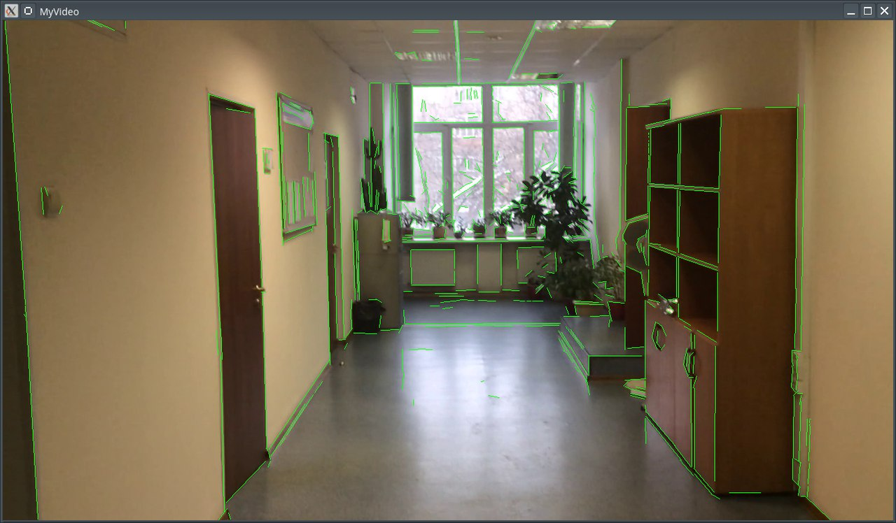
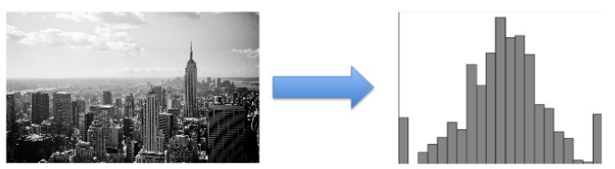
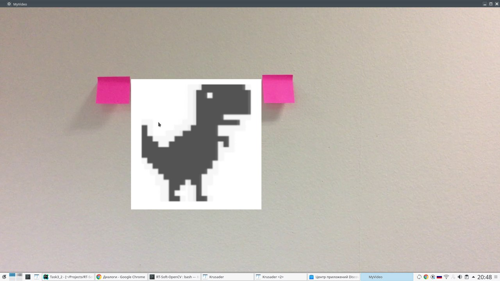
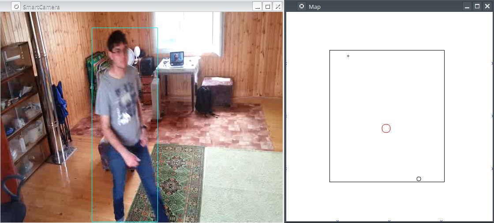

# RT-Soft-OpenCV
Компания «РТСофт» проводит летом традиционный бесплатный трехнедельный тренинг по встраиваемым системам. 
Для студентов и недавних выпускников вузов это прекрасная возможность провести лето с пользой, 
получить множество актуальных практических знаний в области программирования, программной инженерии, 
узнать больше о С++11/14, шаблонах проектирования и дополненной реальности.

Advanced С++11/14 в приложениях дополненной реальности. Участники узнают о современном положении дел в мире C++, 
о последних изменениях в стандарте языка (будут рассмотрены как действующий стандарт C++14, так и следующий C++17) 
и о том, какое влияние эти изменения окажут и уже оказывают на разработку ПО. Также будут рассмотрены особенности 
использования C++ в приложениях дополненной реальности.

## Входные требования:
Уверенное владение языком С++, базовые представления о шаблонах проектирования и принципах разработки ПО. 

Основная целевая аудитория – студенты старших курсов и недавние выпускники технических вузов.

## Формат и сроки проведения
Тренинг состоит из двух этапов: основного курса лекций и самостоятельного выполнения практического задания 
под контролем опытных специалистов компании «РТСофт».

Слушателям выдается задание, которое они выполняют самостоятельно/в команде. На данном этапе проводятся 
очные встречи/консультации со специалистами «РТСофт». В конце студенты должны будут защитить выполненное практическое задание, 
представив результаты в формате презентации с рассказом о проделанной работе.


# Оглавление

[Введение](#Введение)

[1 Дополненная реальность - работа с видео](#1-Дополненная-реальность---работа-с-видео)

[2 Практическое использование шаблонов С++](#2-Практическое-использование-шаблонов-С)

[3 Гистограммы](#3-Гистограммы)

[4 Индивидуальное задание: проект SmartCamera](#4-Индивидуальное-задание-проект-smartcamera)

[Заключение](#Заключение)


# Введение

В период с 3 по 22 июля я проходил практику в компании РТСофт по
направлению «Advanced С++11/14 в приложениях дополненной реальности».
Данная программа была разделена на две части: основного курса лекций и
самостоятельного выполнения практического задания под контролем опытных
специалистов компании «РТСофт». Целью практики было углублённое изучение
языка программирования C++11/14 и рассмотреть особенности использования
C++ в приложениях дополненной реальности. А также получить начальные
навыки работы с библиотекой алгоритмов компьютерного зрения и обработки
изображений «OpenCV».


1 Дополненная реальность - работа с видео
=======================================

**OpenCV** -- (Open Computer Vision) --- библиотека компьютерного зрения
с открытым исходным кодом, предоставляющая набор типов данных и
численных алгоритмов для обработки изображений алгоритмами компьютерного
зрения. Реализована на C/C++.

В библиотеке OpenCV имеются алгоритмы выделения линий из изображения:

1.  **Преобразование Хаффа** - преобразование Хафа является линейным
    преобразованием для обнаружения прямых (есть для элипсов и
    окружностей). Прямая может быть задана уравнением y = mx + b и может
    быть вычислена по любой паре точек (x, y) на изображении. Главная
    идея преобразования Хафа --- учесть характеристики прямой не как
    уравнение, построенное по паре точек изображения, а в терминах её
    параметров, то есть m --- коэффициента наклона и b --- точки
    пересечения с осью ординат. Исходя из этого прямая, заданная
    уравнением y = mx + b, может быть представлена в виде точки с
    координатами (b, m) в пространстве параметров.
2.  **LSD** (Line Segment Detector) -- это детектор отрезков прямых с
    линейным временем поиска. Он быстрее и лучше ищет, чем
    преобразование Хаффа.

Для выделения фильтров, к изображению необходимо применить фильтры:

**Фильтр Cобеля** --- дискретный дифференциальный оператор, вычисляющий
приближённое значение градиента яркости изображения. Результатом
применения оператора Собеля в каждой точке изображения является либо
вектор градиента яркости в этой точке, либо его норма.

```c++
void cvSobel(const CvArr* src, CvArr* dst, int xorder, int yorder, int aperture_size = 3)
```

**Фильтр Канни** -- Оператор обнаружения границ изображения. Использует
многоступенчатый алгоритм для обнаружения широкого спектра границ в
изображениях.

```c++
void Canny(InputArray image, OutputArray edges, double threshold1,
double threshold2, int apertureSize = 3, bool L2gradient = false)
```

Ниже представлен пример выделения линий используя LSD

*Листинг 1*
```c++
Ptr<LineSegmentDetector> ls = createLineSegmentDetector(LSD_REFINE_STD);
while (1) {
    Mat frame;
    std::vector<Vec4f> lines_std;
    bool bSuccess = cap.read(frame); // read a new frame from video
    if (!bSuccess) {
        std::cout << "Cannot read the frame from video file" << std::endl;
        break;
    }
    Mat gray_image;
    cvtColor(frame, gray_image, COLOR_BGR2GRAY);
    ls->detect(gray_image, lines_std); // Detect the lines
    ls->drawSegments(frame, lines_std);
    cv::resize(frame, frame, cv::Size(800, 600));
    imshow("MyVideo", frame); //show the frame in "MyVideo" window
    if (waitKey(30) == 27) {
        break;
    }
}
```


*Рисунок 1 -- Исходное изображение*



*Рисунок 2 --* Результат выделения линий используя LSD

В качестве **домашнего задания № 1** необходимо было реализовать
программу "кротовая нора", которая:

-   читает видео файл "корридор";
-   выделить линии принцельной пола и потолка на изображении
-   отрисовать линии пола и потолка поверх изображение зеленым цветом

*Листинг 2*
```c++
#include <iostream>
#include <opencv2/opencv.hpp>
#include <opencv2/highgui/highgui.hpp>
using namespace std;
using namespace cv;

int main(int argc, char* argv[]) {
    cout << "start" << endl;
    VideoCapture cap("video.mov"); // open the video file for reading
    if (!cap.isOpened()) return -1;
    double fps = cap.get(CV_CAP_PROP_FPS); //get the frames per seconds of the video
    cout << "Frame per seconds : " << fps << endl;
    namedWindow("MyVideo", CV_WINDOW_AUTOSIZE); //create a window called "MyVideo"

    Ptr<LineSegmentDetector> ls = createLineSegmentDetector(LSD_REFINE_STD);
    Mat edges;
    while (1) {
        Mat frame;
        bool bSuccess = cap.read(frame); // read a new frame from video
        if (!bSuccess) {
            cout << "Cannot read the frame from video file" << endl;
            break;
        }

        cvtColor(frame, edges, COLOR_BGR2GRAY); // Перевод в градации серого
        std::vector<Vec4f> lines_std;
        ls->detect(edges, lines_std); // Detect the line

        for (size_t i = 0; i < lines_std.size(); ++i) {
            Point2f p1, p2;
            p1.x = lines_std[i][0]; p1.y = lines_std[i][1];
            p2.x = lines_std[i][2]; p2.y = lines_std[i][3];
            line(frame, p1, p2, Scalar(25, 255, 25));
        }

        imshow("MyVideo", frame); //show the frame in "MyVideo" window
        if (waitKey(30) == 27) {
            break;
        }
    }
}
```



*Рисунок 3 --* Результат работы программы "кротовая нора"

2 Практическое использование шаблонов С++
=======================================

На второй лекции мы познакомились с приемами использования шаблонов C++
и выяснили особенности синтаксиса в языках C++1x. И таким образом, мы
выяснили, что шаблоны C++ - это мощный инструмент для создания
эффективного и компактного кода, а также на практике убедились, что
изменения в стандартах C++1x сделали написание шаблонного кода удобнее и
проще.

В качестве **домашнего задания № 2** необходимо было определить
шаблонный класс матриц NxN и реализовать для него функцию вычисления
определителя матрицы.

*Листинг 3*
```c++
#include <iostream>
using namespace std;

template <class Type>
class Matrix {
    Type **m_matrix;
    size_t m_size;

public:
    Matrix(size_t size);
    virtual ~Matrix();
    Type* operator[] (size_t index);
    Type determinant();
};

template <class Type>
Matrix<Type>::Matrix(size_t size) {
    m_size = size;
    m_matrix = new Type*[size];
    for (size_t i = 0; i < size; ++i) {
        m_matrix[i] = new Type[size];
    }
}

template <class Type>
Matrix<Type>::~Matrix() {
    for (size_t i = 0; i < m_size; ++i) {
        delete[] m_matrix[i];
    }
    delete[] m_matrix;
}

template <class Type>
Type *Matrix<Type>::operator[](size_t index) {
    return m_matrix[index];
}

template <class Type>
Type Matrix<Type>::determinant() {
    Type det = 0;
    for (size_t i = 0; i < m_size; ++i) {
        Type mul = 1;
        for (size_t j = 0; j < m_size; ++j) {
            mul *= m_matrix[(i + j) % m_size][j];
        }
        det += mul;
        mul = -1;
        for (size_t j = 0; j < m_size; ++j) {
            mul *= m_matrix[(i + j) % m_size][m_size - j - 1];
        }
        det += mul;
    }
    return det;
}

int main() {
    size_t size;
    cin >> size;
    Matrix<double> matrix(size);
    for (size_t i = 0; i < size; ++i) {
        for (size_t j = 0; j < size; ++j) {
            cin >> matrix[i][j];
        }
    }
    cout << matrix.determinant();
    return 0;
}
```
3 Гистограммы
===========

Для поиска похожих изображений, достаточно сравнить гистограммы этих
изображений. Этот способ простой и малозатраный, однако обладает низкой
точностью.

Для полутонового изображения гистограмма обладает следующими свойствами:

- это массив чисел
- каждый элемент массива содержит число точек с цветом, который попадает в соответствующий диапазон



*Рисунок 4 -- Гистограмма для полутонового изображения*

В **домашнем задании № 3** нужно было написать программу для расчета
гистограмм для набора изображений, которые находятся в папке. И написать
функктор, позволяющий упорядочить набор изображений по степени похожести
(сравниваем на основе гистограмм) на образец при помощи функции
`std::sort`.

*Листинг 4*
```c++
#include <iostream>
#include <algorithm>
#include <vector>
#include <opencv2/opencv.hpp>
using namespace std;
using namespace cv;

#define File_Name_Len 80

class Image {
    MatND m_hist;
    char m_name[File_Name_Len];

public:
    Image(const char *filename);
    Image(const Image &obj);
    const char *getName() const;
    MatND getHist() const;
};

Image::Image(const char *filename) {
    strcpy(m_name, filename);
    int histSize = 256; // bin size
    float range[] = { 0, 255 };
    const float *ranges[] = { range };
    Mat img = imread(filename, 0);
    calcHist(&img, 1, 0, Mat(), m_hist, 1, &histSize, ranges, true, false); // Calculate histogram
}

const char *Image::getName() const {
    return m_name;
}

MatND Image::getHist() const {
    return m_hist;
}

Image::Image(const Image &obj) {
    strcpy(m_name, obj.getName());
    m_hist = obj.getHist();
}

// Функтор сортировки
class Similar {
    MatND m_cmpHist;

public:
    Similar(const char *cmpImage);
    bool operator() (Image &a, Image &b);
};

Similar::Similar(const char *cmpImage) {
    Mat grey = imread(cmpImage, 0);
    int histSize = 256; // bin size
    float range[] = { 0, 255 };
    const float *ranges[] = { range };
    calcHist(&grey, 1, 0, Mat(), m_cmpHist, 1, &histSize, ranges, true, false); // Calculate histogram
}

bool Similar::operator()(Image &a, Image &b) {
    double cmpA = compareHist(a.getHist(), m_cmpHist, CV_COMP_CORREL);
    double cmpB = compareHist(b.getHist(), m_cmpHist, CV_COMP_CORREL);
    return cmpA > cmpB;
}

int main() {
    char imagesFileNames[][File_Name_Len] = {
        "images/box.JPG",
        "images/chair.JPG",
        "images/computer1.JPG",
        "images/computer2.JPG",
        "images/fire_extinguisher.JPG",
        "images/hanger.JPG",
        "images/keyboard.JPG",
        "images/monitor.JPG",
        "images/switches.JPG"
    };
    size_t count = sizeof imagesFileNames / File_Name_Len;

    vector<Image> images;
    for (size_t i = 0; i < count; ++i) {
        images.push_back(Image(imagesFileNames[i]));
    }

    Similar similaritySort("cmpImage.JPG");
    sort(images.begin(), images.end(), similaritySort);

    for (size_t i = 0; i < count; ++i) {
        cout << images[i].getName() << endl;
    }

    return 0;
}
```

В **домашнем задании № 4** нужно было реализовать программу "кротовая
нора":

- читает изображение с доской и стикером;
- читает изображение "динозавра"
- находит розовый стикер на доске
- отображает динозавра "привязанного" к точке розового стикера

*Листинг 5*
```c++
#include <iostream>
#include <vector>
#include <algorithm>
#include <opencv2/opencv.hpp>
#include <math.h>

// Функция записывает в stickersCoords координаты стикеров
void recogniseStickersByThreshold(cv::Mat image, std::vector<std::vector<cv::Point>> &stickersCoords) {
    cv::Mat image_hsv;
    cv::cvtColor(image, image_hsv, cv::COLOR_BGR2HSV); // Преобразуем в hsv
    cv::Mat tmp_img(image.size(), CV_8U);
    // Выделение подходящих по цвету областей. Цвет задается константой :)
    cv::inRange(image_hsv, cv::Scalar(100, 100, 100), cv::Scalar(255, 255, 255), tmp_img);
    // "Замазать" огрехи в при выделении по цвету
    cv::dilate(tmp_img, tmp_img, cv::Mat(), cv::Point(-1, -1), 3);
    cv::erode(tmp_img, tmp_img, cv::Mat(), cv::Point(-1, -1), 1);
    //Выделение непрерывных областей
    cv::findContours(tmp_img, stickersCoords, CV_RETR_EXTERNAL, CV_CHAIN_APPROX_NONE);
}

bool cmpPoint(const cv::Point &a, const cv::Point &b) {
    return a.x < b.x || a.x == b.x && a.y < b.y;
}

int main() {
    using namespace cv;
    using namespace std;

    cout << "start" << endl;
    VideoCapture cap("video.mov"); // open the video file for reading
    if (!cap.isOpened()) return -1;
    double fps = cap.get(CV_CAP_PROP_FPS); //get the frames per seconds of the video
    cout << "Frame per seconds : " << fps << endl;
    namedWindow("MyVideo", CV_WINDOW_AUTOSIZE); //create a window called "MyVideo"
    // Считываю изображение динозавра
    Mat dino = imread("dino.png");

    std::vector<std::vector<cv::Point>> stickersCoords;
    while (1) {
        Mat frame;
        bool bSuccess = cap.read(frame); // read a new frame from video
        if (!bSuccess) {
            cout << "Cannot read the frame from video file" << endl;
            break;
        }

        recogniseStickersByThreshold(frame, stickersCoords);
        cv::Point sticker1 = *max_element(stickersCoords.front().begin(), stickersCoords.front().end(), cmpPoint);
        cv::Point sticker2 = *min_element(stickersCoords.back().begin(), stickersCoords.back().end(), cmpPoint);

        // Масштабирование
        int side = abs(sticker1.x - sticker2.x);
        Mat imgForPaste;
        cv::resize(dino, imgForPaste, cv::Size(side, side));
        // Слияние коартинок
        Mat roi = frame(Rect(min(sticker1.x, sticker2.x), min(sticker1.y, sticker2.y), side, side));    // подматрица frame
        imgForPaste.copyTo(roi);

        imshow("MyVideo", frame); //show the frame in "MyVideo" window
        if (waitKey(30) == 27) {
            break;
        }
    }
    return 0;
}
```



*Рисунок 5 -- Результат работы программы, отображающей динозавра между стикерами*

В **домашнем задании № 4** необходимо было написать программу для
расчета характеристичесих точек для набора изображений, которые
находятся в папке. И написать функктор, позволяющий упорядочить набор
изображений по степени похожести (сравниваем на основе характеристичесих
точек) на образец при помощи функции `std::sort`.

*Листинг 6*
```c++
#include <iostream>
#include <algorithm>
#include <vector>
#include <opencv2/opencv.hpp>
#include <opencv2/xfeatures2d.hpp>
using namespace std;
using namespace cv;

cv::Ptr<Feature2D> f2d = xfeatures2d::SURF::create();

Mat createDescriptors(const char * imgFilename) {
    Mat descriptors, img = imread(imgFilename);
    vector<KeyPoint> keypoints;
    f2d->detectAndCompute(img, noArray(), keypoints, descriptors);
    return descriptors;
}

class Image {
    Mat m_descriptors;
    string m_name;

public:
    Image(const char *filename);
    string getName() const;
    Mat getDescriptors() const;
};

Image::Image(const char *filename) {
    m_name = filename;
    m_descriptors = createDescriptors(filename);
}

string Image::getName() const {
    return m_name;
}

Mat Image::getDescriptors() const {
    return m_descriptors;
}

// Функтор сортировки
class Similar {
    Mat m_cmpDescriptors;

private:
    std::vector< DMatch > getGoodMatches(Mat descr);

public:
    Similar(const char *cmpImage);
    bool operator() (Image &a, Image &b);
};

Similar::Similar(const char *cmpImage) {
    m_cmpDescriptors = createDescriptors(cmpImage);
}

bool Similar::operator()(Image &a, Image &b) {
    // Сравниваю по количеству хороших точек
    return getGoodMatches(a.getDescriptors()) > getGoodMatches(b.getDescriptors());
}

std::vector< DMatch > Similar::getGoodMatches(Mat descr) {
    FlannBasedMatcher matcher; // FLANN - Fast Library for Approximate Nearest Neighbors
    vector< vector< DMatch> > matches;
    matcher.knnMatch(m_cmpDescriptors, descr, matches, 2); // find the best 2 matches of each descriptor
    vector< DMatch > goodMatches;
    for (int k = 0; k < std::min(m_cmpDescriptors.rows - 1, (int)matches.size()); k++) {
        if ((matches[k][0].distance < 0.6 * (matches[k][1].distance)) && ((int)matches[k].size() <= 2 &&
            (int)matches[k].size() > 0)) {
            // take the first result only if its distance is smaller than 0.6*second_best_dist
            // that means this descriptor is ignored if the second distance is bigger or of similar
            goodMatches.push_back(matches[k][0]);
        }
    }
    return goodMatches;
}

int main() {
    std::vector<Image> images = {
        "images/box.JPG",
        "images/chair.JPG",
        "images/computer1.JPG",
        "images/computer2.JPG",
        "images/fire_extinguisher.JPG",
        "images/hanger.JPG",
        "images/keyboard.JPG",
        "images/monitor.JPG",
        "images/switches.JPG"
    };

    Similar similaritySort("cmpImage.JPG");
    sort(images.begin(), images.end(), similaritySort);

    for (const auto& image : images) {
        cout << image.getName() << endl;
    }

    return 0;
}
```


4 Индивидуальное задание: проект SmartCamera
==========================================

В ходе выполнения итогового проекта, индивидуальная тема которого
заранее обсуждалась с преподавателем, была разработана программа,
которая считывает видеопоток с камеры видеонаблюдения, установленной
внутри помещения. И на этом видеопотоке обнаруживает и выделяет людей,
находящихся внутри помещения. А также позволяет показать их положение на
плане здания.

*Листинг 9 -- Файл «MotionDetector.cpp»*
```c++
#include "MotionDetector.h"
#include <opencv2/optflow/motempl.hpp>

void MotionDetector::detectMovingRegions(const cv::Mat &currentFrame, double timestamp, std::vector<cv::Rect> &targets,
    cv::Mat &mask)
{
    // 1. Сглаживаем текущий кадр (currentFrame) фильтром Гаусса, чтобы избавиться от шумов.
    cv::Mat bluredImage;
    cv::cvtColor(currentFrame, bluredImage, CV_BGR2GRAY);
    cv::GaussianBlur(bluredImage, bluredImage, cv::Size(3, 3), -1);

    // 2. Из сглаженного текущего кадра (m_bluredImage ) вычитаем предыдущий (m_previousImage).
    // Если искомые изображения были в градациях серого, то и значения пикселей в разности (mask)
    // будут изменяться от нуля до 255 (при восьми битной глубине цвета).
    cv::absdiff(bluredImage, m_previousImage, mask);

    // 3. Сравниваем значения полученной разности с некоторым пороговым значением (MOTION_THRESHOLD).
    // Если значение пикселя больше порогового, то этот пиксель принадлежит движущемуся объекту, иначе отбрасываем его.
    // Теперь мы получили бинарное изображение (mask), где ноль означает, что пиксель не движется,
    // отличное от нуля значение – пиксель движется.
    cv::threshold(mask, mask, MOTION_THRESHOLD, 255, cv::THRESH_BINARY);

    // 4. Применяем морфологические операции закрытия и открытия, чтобы избавиться от движущихся регионов малого размера
    // (шумы камеры). Полученное изображение (mask) и есть движущийся контур.
    cv::morphologyEx(mask, mask, cv::MORPH_CLOSE, cv::Mat());
    cv::morphologyEx(mask, mask, cv::MORPH_OPEN, m_openingKernel,
        cv::Point(-1, -1), 1, cv::BORDER_CONSTANT, cv::Scalar(0));

    // 5. Наносим бинарное изображение на так называемое изображение истории движения (motionHistoryImage).
    // На нём нарисованы движущиеся контуры за последние, например, 200 мс (m_motionHistoryDuration).
    // Контуры были получены через постоянные промежутки времени. Интенсивность пикселей контура
    // обратно пропорциональна времени, которое прошло от измерения контура до данного момента.
    // Т.е. чем раньше был получен движущийся контур, тем он бледнее изображён на изображение истории движения.
    cv::motempl::updateMotionHistory(mask, m_motionHistoryImage, timestamp, m_motionHistoryDuration);

    // 6. Выделяем регионы (targets) с различными движениями на изображение истории движения.
    cv::motempl::segmentMotion(m_motionHistoryImage, m_segmask, targets, timestamp, m_maxMotionGradient);

    // 7. Отбрасываем все регионы, площадь которых меньше некоторого значения (MIN_CONTOUR_AREA).
    std::vector<cv::Rect>::iterator endIt = targets.end();
    for (std::vector<cv::Rect>::iterator it = targets.begin(); it != endIt; ++it) {
        if (cv::countNonZero(mask(*it)) < MIN_CONTOUR_AREA || (*it).width * (*it).width < MIN_CONTOUR_AREA)
            targets.erase(it);
    }
    bluredImage.copyTo(m_previousImage);
}
```



*Рисунок 6 -- Результат работы программы «SmartCamera»*

Таким образом, в результате работы над проектом было разработано
полностью функционирующее приложение, соответствующее техническому заданию.

# Заключение

В ходе практики были приобретены навыки работы с библиотекой алгоритмов
компьютерного зрения и обработки изображений «OpenCV». А также были
получены знания об особенностях синтаксиса в языках C++11/14. Помимо
этого в ходе прохождения практики были изучены некоторые принципы работы
в больших компаниях, освоены методы рефакторинга кода и его быстродействия.
